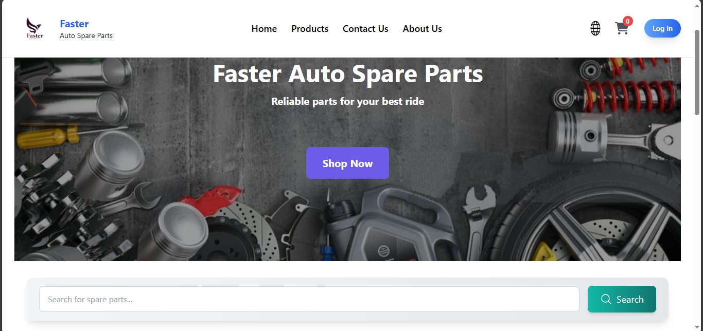
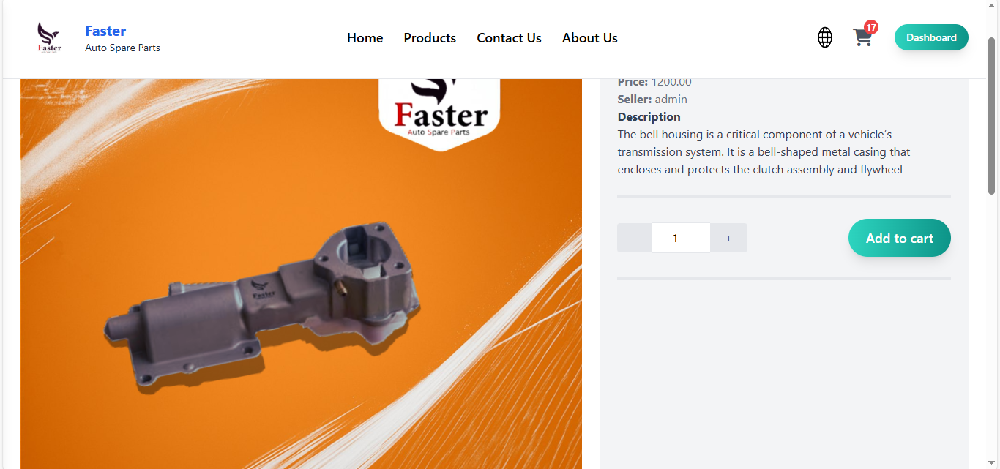
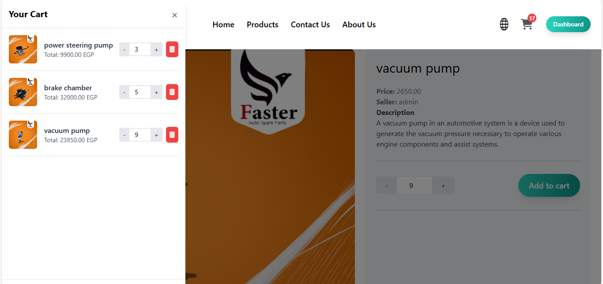

# Faster-Parts E-commerce Platform

**Monolithic Architecture | Django 5.2**  
An experimental full‑stack web application built using Django’s monolithic pattern.  

---

## ��� Overview

This repository contains a prototype e‑commerce platform developed for learning and demonstration purposes. The codebase is intentionally monolithic: backend and frontend are coupled, and all HTML is rendered on the server using Django's template engine. There are **no RESTful APIs**; users interact with the site through server‑side rendering (SSR) only.

Security is taken seriously. All forms and POST endpoints are protected with Django’s built‑in **CSRF tokens**, ensuring robustness against cross‑site request forgery attacks.


---

## ��� Architecture & Design

- **Framework**: Django (currently 5.2)
- **Architecture**: Monolithic – a single deployable unit running on Django’s WSGI/ASGI server.
- **Frontend**: Server‑side rendered HTML templates with Tailwind CSS for styling and minimal JavaScript.
- **Data persistence**: SQLite by default; easily configurable for PostgreSQL or MySQL via `settings.py`.

---

## ��� Django Apps Breakdown

Each mini‑app encapsulates a specific domain of functionality:

1. **Core**  
   Handles the homepage, authentication workflows (login/signup), and session management. Central routing and base templates reside here.

2. **Items**  
   Manages the product catalog: listing, searching, and detailed product views. The backbone of the shopping experience.

3. **Cart**  
   Implements a dynamic shopping cart using browser JavaScript and Django session storage. Cart state persists across pages without a backend API.

4. **Conversation**  
   Provides an internal messaging system allowing registered users to exchange messages. All interactions occur through standard Django views and forms.

5. **Dashboard**  
   An admin panel used by staff to add, edit, and manage inventory. Extends Django’s admin with custom views when necessary.

---

## ��� Security

- Django’s CSRF protection is enforced on all views accepting POST data.
- User passwords and sessions leverage Django’s built‑in authentication system.
- Input validation and escape filters are used in templates to mitigate XSS.

---

## ��� Screenshots

Below are some of the key screens:






---

## ��� Getting Started (Local Development)

```bash
# 1. Clone the repository
git clone https://github.com/<your-org>/Faster-Parts.git
cd Faster-Parts/Faster-Parts/E-commerce-Platform

# 2. Create & activate a virtual environment (Windows)
python -m venv env
.\env\Scripts\activate

# 3. Install dependencies
pip install -r requirements.txt

# 4. Apply migrations
python manage.py migrate

# 5. (Optional) Create a superuser
python manage.py createsuperuser

# 6. Start the development server
python manage.py runserver
```

Visit `http://127.0.0.1:8000` in your browser.

---

## ��� Deployment Notes

This project is easily containerized or deployed to any WSGI/ASGI‑compatible host. Update `SECRET_KEY`, `DEBUG`, and `DATABASES` via environment variables for production.

---

## ���‍��� Developed By

**Mohamed Mady**  
- LinkedIn: [LinkedIn Profile](https://www.linkedin.com/in/mohamed-mady-940b87264/)  
- Portfolio: [My website](https://mohamedmadyportfolio.vercel.app/)  


---

Thank you for exploring this experimental platform!  
For questions or feedback, feel free to reach out via LinkedIn or GitHub.
